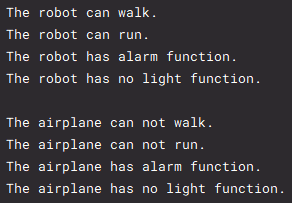

# Interface

<br />

## 인터페이스란

클래스와 달리 객체를 생성할 수는 없으며, 클래스에서 구현해야 하는 작업 명세서이다.

인터페이스에서 선언만 되어 있는 기능을 클래스에서 구현해 객체를 생성할 수 있다.

<br />

## 인터페이스를 사용하는 이유

가장 큰 이유는 객체가 다양한 자료형을 가질 수 있기 때문이다.

어떠한 클래스가 인터페이스 여러 개를 ```implements``` 한다면 그 클래스는 여러 개의 인터페이스 타입으로 생성이 가능하다.

<br />

## 예제

MainClass 실행 결과   

