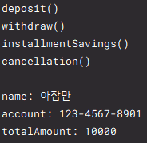

# Abstract Class

클래스의 공통된 부분을 뽑아서 별도의 클래스로 만들어놓고, 이것을 상속해서 사용한다.

 

## 특징

- 멤버 변수를 가진다.
- abstract 클래스를 상속하기 위해서는 extends를 이용한다.
- abstract 메서드를 가지며, 상속한 클래스에서 반드시 구현해야 한다.
- 일반 메서드로 가질 수 있다
- 생성자도 있다

 

## interface vs abstract class

공통점
- 추상 메서드를 가진다.
- 객체 생성이 불가하다
- 자료형(타입)으로 사용된다.

차이점
- interface   
  * 상수, 추상 메서드만 가진다.
  * 추상 메서드를 구현만 하도록 한다.
  * 다형성을 지원한다.
- abstract class
  * 클래스가 가지는 모든 속성과 기능을 가진다.
  * 추상 메서드 구현 및 상속의 기능을 가진다.
  * 단일 상속만 지원한다.

 

## 예제

MainClass 실행 결과

