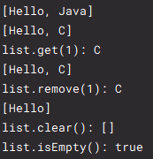
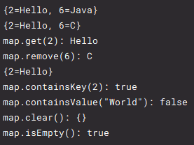

# Collections

 

## List

인터페이스로, 이를 구현한 클래스는 인덱스를 이용해 데이터를 관리한다.
- 인덱스를 이용한다.
- 데이터 중복이 가능하다.

구현 클래스
- Vector
- **ArrayList**
- LinkedList

### ArrayList

- add(data)   
  데이터 추가
- set(index, data)   
  인덱스를 지정하며 데이터 추가 혹은 교체
- get(index)      
  추출
- remove(index)   
  제거
- clear()   
  데이터 전체 제거
- isEmpty()   
  데이터 유무

 

## Map

인터페이스로, 이를 구현한 클래스는 key를 이용해 데이터를 관리한다.
- key를 이용한다.
- key는 중복될 수 없다.
- 데이터 중복이 가능하다.

구현 클래스
- **HashMap**

### HashMap

- put(key, data)   
  데이터 추가 혹은 교체
- get(key)   
  추출
- remove(key)   
  제거
- containsKey(key)   
  key 포함 여부
- containsValue(data)   
  데이터 포함 여부
- clear()   
  전체 제거
- isEmpty()   
  데이터 유무

 

## 예제

MainClass 실행 결과   
- List   

  
- Map   

