# 네트워킹

## 네트워크 데이터 입력 및 출력

네트워크 대상(객체) 사이에 입/출력(InputStream, OutputStream)를 이용해서 데이터를 입력하고 출력한다

 

## Socket

네트워크상에서 데이터를 주고받기 위한 장치

- 클라이언트   
ServerSocket에서 socket 반환받음

- 서버   
ServerSocket 생성

 

## 예제

### MainClass 실행 

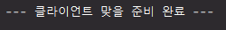

`localhost:9000` 접속   
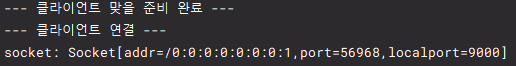

---

### MainServer, MainClient 실행

MainServer 실행   
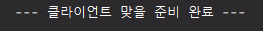

MainClient 실행   
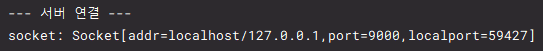   
`MainServer`
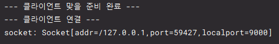

---

### ServerClass, ClientClass 실행

ServerClass 실행   
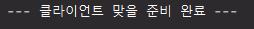

ClientClass 실행   
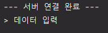

#### 데이터 입력   
`ServerClass`   
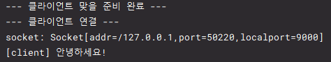 

`ClientClass`   
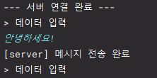   

#### `STOP` 입력   
`ServerClass`   
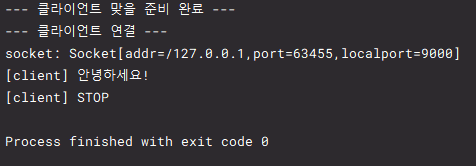

`ClientClass`   
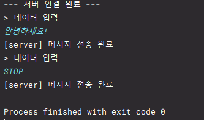
